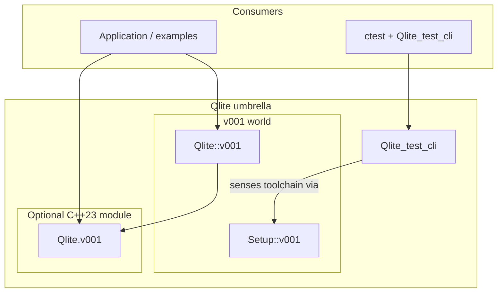
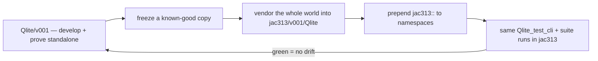

# Architecture and design — v001

How Qlite is structured, why it's an umbrella over self-contained version worlds, and how
a proven copy is forward-ported into jac313. The [v001 README](../README.md) is the
overview; this is the detail.

---

## Layout

```
Qlite/
├── README.md                 # umbrella headline
├── LICENSE                   # governs both versions
├── v001/                     # this world — complete C++23 world
│   ├── README.md
│   ├── bootstrap.sh          # sense host → build the runner → hand off
│   ├── Qlite/                # the wrapper component  (Qlite::v001)
│   ├── Setup/                # toolchain sensing       (Setup::v001)
│   └── docs/                 # this documentation set
└── v002/                     # complete C++26 world (faithful sibling)
```

The legacy `jacQlite` / `jac::qlite` repo is no longer required to build — its
implementation now lives here under `Qlite/`. It remains only as historical origin and is
being retired.

---

## The umbrella over self-contained version worlds

Qlite is a **versioned umbrella** over two fully self-contained worlds, `v001/` (C++23)
and `v002/` (C++26). Every component lives under `Qlite::vNNN` / `Setup::vNNN`. The
`vNNN` suffix is a **contract, not a comment**: it reserves room for a future version
without breaking callers who pin a version in their includes or module imports.

The worlds are **fully duplicated** — DRY is deliberately *not* applied across them:

- testing stays isolated (changing v001 only tests v001);
- there's no cross-version build/test explosion;
- each world can move its toolchain and language standard independently (v001 is C++23,
  v002 is C++26).

The one coordination cost: a shared-infra fix made *before* the two worlds diverge must be
applied to each `vNNN/`. After they diverge, they are free to differ.



---

## The wrapper's single source of truth

The wrapper has **one implementation body** (`Sqlite.body.hpp`), an include-free
fragment, pasted by both front-ends:

- the **textual header** (`Sqlite.hpp` → `v001.hpp`) makes `std` + `<sqlite3.h>` names
  visible via textual includes, then pastes the body inside `namespace Qlite::v001`;
- the optional **C++23 module** (`Qlite.v001.cppm`) puts `<sqlite3.h>` in the global
  module fragment and pastes the *same* body inside `export namespace`.

This keeps the textual and module paths from drifting. See
[Qlite/README.md](../Qlite/README.md#implementation-layout-single-source-of-truth) and
[Modules.md](Modules.md).

---

## Standalone + embed, never depend

This is the philosophy that drives the whole layout:

1. **Standalone + embed, never depend.** Qlite is developed and proven in isolation here,
   then a *copy* is forward-ported into jac313. jac313 **never build-depends on this
   repo** — it embeds a vendored copy. The "outside-dependency trap" — moved tags, missing
   checkouts, upstream churn — is what breaks builds; a vendored copy can't be broken by
   upstream.
2. **Self-contained version worlds.** As above — each world is a complete copy.
3. **Bring it all in, wholesale.** When embedding into jac313, bring the complete self-
   contained world (even unused parts) — one integration event, not N. Unused-but-
   compiling code is cheap; a missing piece discovered later is expensive.
4. **Namespace rule.** Standalone is jac313 minus the `jac313::` umbrella:
   `Qlite::v001` ↔ `jac313::Qlite::v001`; `Setup::v001` ↔ `jac313::Setup::v001`. The
   forward-port simply prepends `jac313::`.
5. **Shared test runner as anti-drift.** The same `Qlite_test_cli` + same test suite runs
   in **both** this repo and inside jac313, proving the embedded copy hasn't drifted.

---

## The forward-port-to-jac313 story



1. **Develop + prove here.** All wrapper work, all toolchain sensing, all tests happen in
   this standalone world first.
2. **Vendor wholesale.** A copy of the complete world is brought into jac313 as
   `jac313::Qlite::v001` — one integration event, including parts jac313 doesn't yet use.
3. **Namespace only.** The forward-port prepends `jac313::`; nothing else about the code
   needs to change because the standalone namespace was deliberately jac313-minus-umbrella.
4. **Prove no drift.** The identical `Qlite_test_cli` and test suite run in both places. A
   green run in jac313 proves the vendored copy matches what was proven here.

_The mechanics of the freeze/vendor step (scripts, tags) are owned elsewhere and are
**_TBD_** in this doc._

---

## Design principles

- **Standalone + embed, never depend** — the vendored copy can't be broken by upstream.
- **Self-contained worlds** — no DRY across versions; each moves independently.
- **Wholesale embedding** — one integration event, not N.
- **Versioned namespaces** — `::vNNN` is a contract, not a comment.
- **Single body, two front-ends** — textual header and module can't drift.
- **Shared runner as anti-drift** — the same suite proves the embedded copy in jac313.
